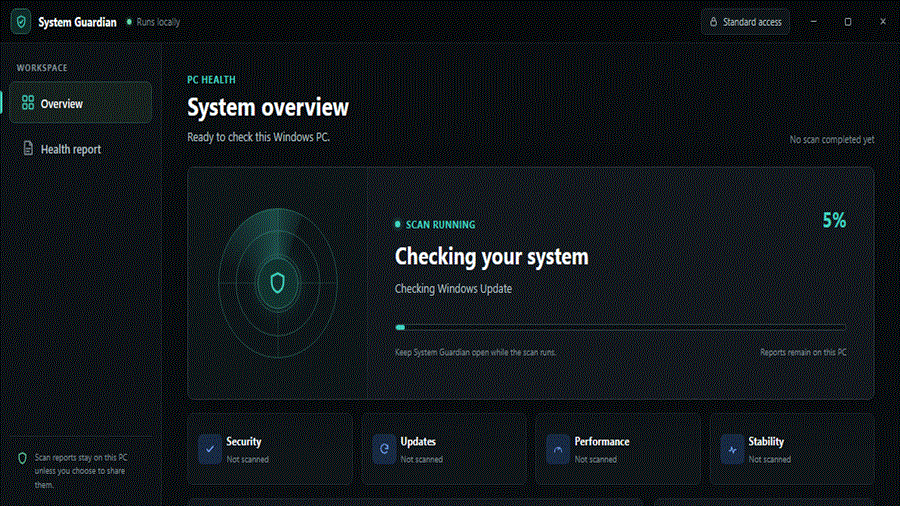

# System Guardian

[](https://github.com/Rafay-Mo/systemguard/actions/workflows/windows-build.yml)

## Problem

A privileged native Windows host driven by a web renderer must expose useful diagnostics and remediation without turning renderer compromise into privileged command execution. System Guardian addresses that boundary while making a small, explicit set of Windows health checks understandable and actionable.

## Design

```text
Untrusted WebView2 renderer
        |
        | exact JSON command schema + source URI check
        v
Native deny-by-default command table
        |
        | native approval for every repair request
        v
Fixed built-in Windows tools

Read-only scanner -> injectable system probe -> Windows APIs/WMI/registry
```

The key trade-off is intentionally narrow remediation: the renderer can request only fixed action IDs, the native host asks again, and the app opens a known Windows surface rather than directly changing privileged state. This gives up one-click repair breadth to keep the renderer-to-host capability small and auditable. The complete boundary and command table are in [`docs/threat-model.md`](docs/threat-model.md).

## Evidence

The automated matrix detected all 12 isolated broken states: **0 false positives across 18 fixture decisions (12 broken, 6 clean)**. The six clean fixtures also produced zero findings across 42 individual check results.

| Condition | Expected | Detected | Other findings |
| --- | --- | --- | ---: |
| Clean baseline | all good | yes | 0 |
| Clean threshold boundaries | all good | yes | 0 |
| Healthy Windows 10 22H2 laptop | all good | yes | 0 |
| Healthy Windows 11 24H2 workstation | all good | yes | 0 |
| Large disk with comfortable capacity | all good | yes | 0 |
| Recently updated with one optional update | all good | yes | 0 |
| Pending Windows updates | attention | yes | 0 |
| Windows Update API unavailable | review | yes | 0 |
| Defender antivirus off | attention | yes | 0 |
| Defender real-time protection off | attention | yes | 0 |
| Defender signatures four days old | review | yes | 0 |
| Disk 96% full | attention | yes | 0 |
| Disk 90% full | review | yes | 0 |
| Fifteen startup entries | review | yes | 0 |
| Device Manager error | review | yes | 0 |
| Pending restart flag | review | yes | 0 |
| Windows Event Log stopped | attention | yes | 0 |
| Windows Management Instrumentation stopped | attention | yes | 0 |

Ten real full-scan runs measured a serial baseline of **4,757.6 ms p50 / 10,066.2 ms p95**. After independent checks were parallelized, the same method measured **5,074.7 ms p50 / 45,796.2 ms p95**; one externally variable Windows Update call dominated the tail, so this sample does not support a production latency-improvement claim. Method, machine context, raw interpretation, and caveats are in [`docs/evaluation.md`](docs/evaluation.md).



## Limitations

The scanner covers seven signals, not every cause of a slow or unstable PC. It does not separately detect paused-update policy, diagnose Device Manager root causes, inspect every Windows service, prove a machine is malware-free, or replace Microsoft/OEM diagnostics.

The health score starts at 100, subtracts 16 for each `attention` result and 7 for each `review` result, and is floored at 35. It is a deterministic summary of these seven checks only; it is not a security grade, failure probability, performance benchmark, or claim that the whole system is healthy. Next engineering work would expand first-party API integration and repeat latency measurements across controlled Windows VMs, builds, and hardware without widening the native command boundary.

## Run it

```powershell
.\Start-SystemGuardian.cmd
```

## Tests & CI

[](https://github.com/Rafay-Mo/systemguard/actions/workflows/windows-build.yml)

CI runs on `windows-latest`, compiles the desktop host, executes the real-probe smoke test, evaluates the 12 broken and six clean fixtures, runs the grouped hostile command-boundary suite, validates UI JavaScript and the troubleshooting knowledge base, checks backend syntax, and builds the release archive.

```powershell
powershell -NoProfile -ExecutionPolicy Bypass -File .\scripts\verify.ps1
```